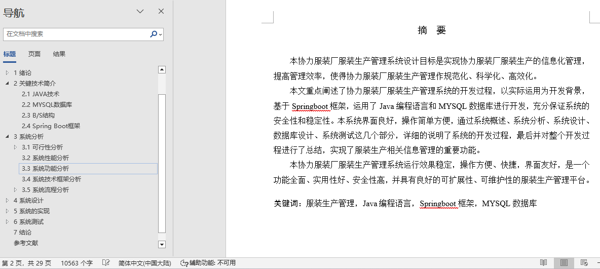

## 基于SpringBoot的服装生产管理系统(程序+报告)

- <b>完整代码获取地址：从戎源码网 ([https://armycodes.com/](https://armycodes.com/))</b>
- <b>技术探讨、资料分享，请加QQ群：692619798</b> 
- <b>作者微信：19941326836  QQ：952045282</b> 
- <b>承接计算机毕业设计、Java毕业设计、Python毕业设计、深度学习、机器学习</b>
- <b>选题+开题报告+任务书+程序定制+安装调试+论文+答辩ppt 一条龙服务</b>
- <b>所有选题地址 ([https://github.com/YuLin-Coder/AllProjectCatalog](https://github.com/YuLin-Coder/AllProjectCatalog)) </b>

## 项目介绍
基于SpringBoot的服装生产管理系统，系统包含两种角色：用户、管理员，系统分为前台和后台两大模块，主要功能如下：

登录界面的实现
用户要想进入本系统必须进行登录操作，进入对应角色登录界面，在登录界面输入系统账号、登录密码，选择登录类型，点击登录按钮进行登录系统。

系统主界面的实现
用户在系统前台可查看系统信息，包括首页、人事安排以及样板等。

用户管理模块的实现
管理员登录后可查询、添加、修改和删除用户信息。

人事安排管理模块的实现
管理员可增删改查人事安排信息。

工资管理模块的实现
管理员可增删改查工资信息，用户登录后可查看个人工资信息。

考勤管理模块的实现
用户登录后可添加考勤信息，管理员可查看用户添加的考勤，并可对其进行审核操作。

样板管理模块的实现
管理员可增删改查样板信息。

## 项目技术
- 编程语言：Java
- 数据库：MySQL
- 项目管理工具：Maven
- 前端技术：HTML、CSS、JavaScript、Jquery、Vue
- 后端技术：Spring、SpringMVC、MyBatis

## 运行环境
- JDK版本：JDK1.8及以上
- 开发工具：IDEA、Ecplise、Myecplise都可以
- 数据库: MySQL5.7及以上
- Maven：maven3.0及以上
- Node：14.14.0及以上

## 运行截图

